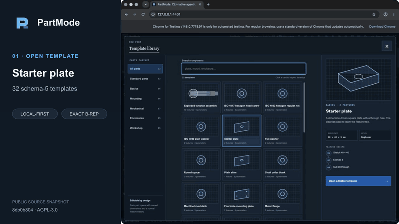
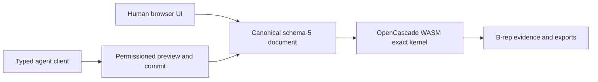

# PartMode

PartMode is free and open-source, browser-based parametric CAD built for people
and agents. It combines OpenCascade WebAssembly, replicad, and three.js with
editable parts, structured assemblies, exact B-rep evaluation, drawings, and
standard interchange formats.

- **Free and open source** — use, inspect, modify, and self-host PartMode under
  the GNU AGPL v3 license.
- **Browser-based** — create and edit exact CAD models through a local-first web
  interface, with no desktop CAD installation required.
- **Agent-first CAD** — permissioned agents use typed operations against the
  same editable documents and exact geometry evidence as the human interface.
  Agent-first does not mean agent-only: people and agents can build, inspect,
  revise, and export the same models.

[Try PartMode](https://partmode.com/) · [Read the in-product help](https://partmode.com/help)

[](docs/media/partmode-contributor-demo.mp4)

_18-second contributor demo: open an editable template, make a human parameter
edit, approve a typed agent change, rebuild exact geometry, and export STEP._

The demo was captured locally from the public source snapshot at `8db0b804`
using the production typed-agent protocol. See the [capture evidence](docs/media/README.md).

## What is included

- Parametric sketches and feature history
- Multiple exact solid bodies and reusable part definitions
- Assembly occurrences, mates, exploded views, and sections
- Configurations, inspection, measurements, and mass properties
- STEP import/export plus STL, AMF, 3MF, SVG, DXF, and PDF outputs
- Browser-approved agent sessions and opt-in server-headless projects
- Regression tests for document, topology, B-rep, export, and visible UI behavior

PartMode is engineering software, not a certification authority. Validate
dimensions, tolerances, material choices, and released manufacturing data for
your application.

## Architecture at a glance



The browser and agent paths edit the same document model and reuse the same
exact kernel-worker implementation. See the
[architecture guide](docs/architecture.md) for the server, relay, headless,
drawing, and verification entry points.

## Run locally

PartMode requires Node.js 22.13 or newer.

```sh
npm ci
npm run build
npm start
```

The server listens on `http://127.0.0.1:4401` by default. Browser-local CAD does
not require an account or external service.

## Verify a change

```sh
npm run ci:gate
```

The focused gate type-checks and builds the release, verifies the static and
runtime manifests, and exercises the local HTTP, account, identity, MCP, cloud,
and entrypoint contracts. The larger CAD and browser suites remain available as
individual `smoke:*` scripts and through `npm run release:gate`.

## Contribute

Start with a [good first issue](https://github.com/BOMWiki/partmode/labels/good%20first%20issue)
or a [help wanted issue](https://github.com/BOMWiki/partmode/labels/help%20wanted).
Comment before starting so scope and ownership are clear.

For a behavior change:

1. Stay within the issue's accepted boundary.
2. Add or update the narrowest relevant regression.
3. Run `npm run ci:gate`.
4. Run every affected `smoke:*` command listed in the issue.

`ci:gate` is the focused baseline. CAD, kernel, assembly, export, and visible UI
changes also need their affected smoke checks. For CAD changes, screenshots and
mesh counts are supporting evidence only. Report the settled document result
and exact kernel, B-rep, topology, or export evidence required by the issue.
Visible behavior changes also need browser evidence.

| Area | Start here | Typical focused checks |
| --- | --- | --- |
| Browser UI and recovery | `src/page.html`, `src/static/studio.js`, `src/static/studio-storage.js` | `smoke:browser`, `smoke:usability-ui` |
| Documents and features | `src/static/studio-project-v5.js`, `src/static/studio-v5-runtime-document.js` | affected `smoke:*` feature test |
| Exact geometry and topology | `src/static/studio-kernel.worker.js`, `src/static/studio-brep-evidence.js`, `src/static/studio-topo-naming.js` | `smoke:brep-evidence`, `smoke:topology-hash`, `smoke:cad-regression` |
| Assemblies | `src/static/studio-v5-assembly.js`, `src/static/studio-assembly-*` | `smoke:assembly-runtime` plus the affected assembly smoke |
| Typed agents and headless | `src/static/studio-agent-service.js`, `src/mcp.ts`, `src/relay-hub.ts`, `src/headless-sessions.ts` | `smoke:cloud`, `smoke:mcp`, `smoke:headless-mcp` |
| Drawings and exchange | `src/static/studio-drawing-*`, kernel import and export handlers | affected `smoke:drawing-*`, `smoke:step-determinism` |

[Contributing guide](CONTRIBUTING.md) · [Architecture](docs/architecture.md) ·
[Contribution roadmap](ROADMAP.md) · [Public-source changelog](CHANGELOG.md)

## Repository scope

This repository contains the standalone PartMode product source, public
technical documentation, fixtures, and tests. Production credentials, private
operations, deployment configuration, internal handovers, and release records
are intentionally outside this repository.

The BOMWiki organization is the administrative home of this repository;
PartMode does not depend on BOMWiki applications, services, databases, ports,
or deployment infrastructure.

See [CONTRIBUTING.md](CONTRIBUTING.md) before proposing a change and
[SECURITY.md](SECURITY.md) for vulnerability reports. Third-party components
and their licenses are listed in [THIRD_PARTY_NOTICES.md](THIRD_PARTY_NOTICES.md).

## License

PartMode is licensed under the
[GNU Affero General Public License v3.0 only](LICENSE). Copyright © 2026 Sphinx.
