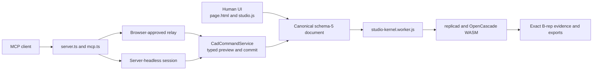

# PartMode architecture

PartMode has two authoring surfaces and one document and geometry boundary.
People use the browser interface. Agents use typed operations with explicit
permissions, preview, revision checks, and commit. Both paths edit canonical
schema-5 documents and use the same exact kernel-worker implementation.

## Main boundaries

### Browser product

- `src/page.html` defines the visible application shell and controls.
- `src/static/studio.js` coordinates document, worker, interaction, recovery,
  export, and browser-approved agent behavior.
- Focused modules under `src/static/studio-*.js` own document, feature,
  assembly, drawing, topology, storage, and interaction behavior.

### Canonical document

- `src/static/studio-project-v5.js` defines canonical schema-5 project data.
- `src/static/studio-v5-runtime-document.js` prepares and canonicalizes the
  effective runtime document.
- `src/static/studio-agent-service.js` validates typed operations, creates
  detached previews, enforces revisions, and commits accepted changes.

### Exact kernel

- `src/static/studio-kernel.worker.js` isolates exact modeling work from the UI
  thread and dispatches rebuild, validation, import, export, drawing, and
  inspection requests.
- `src/static/studio-brep-evidence.js` and the topology modules retain the
  evidence required to distinguish an exact result from a visible mesh.
- `src/static/vendor/replicad-oc.module.js` and
  `src/static/vendor/replicad_single.wasm` provide the bundled replicad and
  OpenCascade runtime.

### Agent, relay, and headless paths

- `src/server.ts` composes the HTTP product, accounts, MCP endpoint, live relay,
  and server-headless sessions.
- `src/mcp.ts` exposes the typed MCP tools and routes work to
  `src/relay-hub.ts` or `src/headless-sessions.ts`.
- `src/headless/agent-host.ts` deliberately reuses the same command service and
  kernel-worker implementation used by the visible Studio.

Browser-approved projects remain in the browser and require visible session
approval. Server-headless projects use an explicit per-key grant and persist
under the account. These are separate authority and storage choices.

## Verification map

| Area | Primary entry points | Typical focused checks |
| --- | --- | --- |
| Browser UI and recovery | `src/page.html`, `src/static/studio.js`, `src/static/studio-storage.js` | `npm run smoke:browser`, `npm run smoke:usability-ui` |
| Document and feature behavior | `studio-project-v5.js`, `studio-v5-runtime-document.js`, `studio-v5-feature-types.js` | the affected `npm run smoke:*` command |
| Exact geometry and topology | `studio-kernel.worker.js`, `studio-brep-evidence.js`, `studio-topo-naming.js` | `npm run smoke:brep-evidence`, `npm run smoke:topology-hash`, `npm run smoke:cad-regression` |
| Assemblies | `studio-v5-assembly.js`, `studio-assembly-*` | `npm run smoke:assembly-runtime` plus the affected assembly smoke |
| Typed agents | `studio-agent-service.js`, `studio-cloud-agent-bridge.js` | `npm run smoke:cloud`, `npm run smoke:agent-headless` |
| MCP, relay, and headless | `src/mcp.ts`, `src/relay-hub.ts`, `src/headless-sessions.ts`, `src/headless/*` | `npm run smoke:mcp`, `npm run smoke:headless-mcp` |
| Drawings and exchange | `studio-drawing-*`, kernel import and export handlers | affected `smoke:drawing-*`, `npm run smoke:step-determinism` |

`npm run ci:gate` is the focused baseline, not the entire CAD or browser suite.
Every contribution issue should name the extra runtime, kernel, assembly,
artifact, or browser evidence required for that scope.

## Design rules

- Saved-project compatibility is a product boundary. Do not silently rewrite
  unrelated document fields or discard unknown extensions.
- A shaded result is not exact completion. Require the relevant settled
  document, valid B-rep, persistent topology, or artifact evidence.
- Preview and commit are separate operations. A stale revision must fail rather
  than applying to a different document state.
- Browser-approved and server-headless modes must retain their distinct
  permission, storage, visibility, and artifact boundaries.
- Keep changes narrow enough that their evidence can be reviewed.
